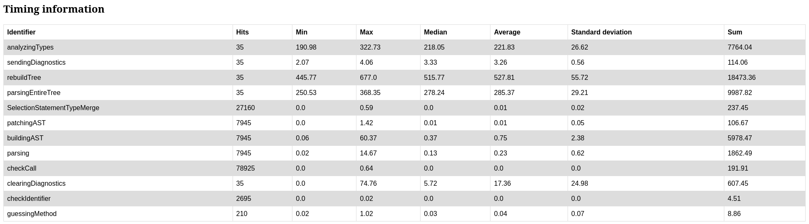

# Endpoints of the web server
On Linux and MacOS, Swift-MesonLSP starts a webserver on `localhost:65000` (If 65000 is already used, `65001` is used and so on)

# `/`

This picture shows an example of the rendered timing information. The project used is mesa and it
got fully parsed 35 times.

- `analyzingTypes` is the section in which all nodes of the AST are annotated with their possible type(s)
- `sendingDiagnostics` is the section, where all diagnostics are sent back to the editor/client
- `rebuildTree` is responsible for clearing all diagnostics, parsing all meson files, annotating the types, sending the newdiagnostics
- `parsingEntireTree` is the section for parsing the entire project, patching the ASTs, etc.
- `SelectionStatementTypeMerge` is part of the type analyzer. It is responsible for merging the possible types after different branches.
- `patchingAST` is the section in which all `subdir('foo')` calls are replaced by nodes referencing the corresponding source files.
- `buildingAST` is the section in which the tree sitter nodes are converted to easier to use objects
- `parsing` is the section for just parsing a file using tree-sitter
- `checkCall` is for checking the arguments of the call (Except type checking at the moment)
- `clearingDiagnostics` is the section in that all diagnostics are cleared before rebuilding the tree.
- `checkIdentifier` checks, if an identifier follows `snake_case`
- `guessingMethod` is a method that attempts to deduce the possible methods that are called on an `any` object.
- `evalStack` is responsible for getting types of variables that were overwritten in previous branches of selection statements.

In this example, it took around half-second to parse the entire mesa meson files, deduce the types and emit diagnostics.

**Note:** The identifiers used may change at any time.

# `/caches`
This page lists the open files and the cached ASTs for the main project and each subproject.

# `/count`
This page is counting the number of occurences of each node type. This could be used e.g. for creating a correlation between the time needed for parsing/type-checking
and the node types. Currently it's just some tables.

# `/status`
This page checks, if each tool that is used by `Swift-MesonLSP` can be found and used.

# `/stats`
**Note**: This one is only available on Linux!

This is just a simple chart using `chart.js` correlating memory usage, the number of notifications and the number of requests. The measurement unit
is one minute.

