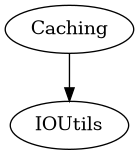

# Caching module
This modules allows to cache the contents of a file in a global location. This is used for caching downloaded wraps, as it is assumed that the same
URL will always return the same file.

The storage location is `~/.cache/swift-mesonlsp/__cache__/`. The filename is `sha256(key) + ".cached"`. Auto cleanup is not provided.

