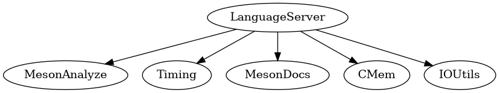

# LanguageServer module
This module combines all other modules and exposes everything using the LanguageServer-Protocol.
Each sourcefile corresponds to either an auxiliary class or implements the response.

- `DeclarationFinder.swift`/`DefinitionFinder.swift` are responsible for finding declarations/definitions.
- `DocumentSymbolCollector.swift` is responsible for collecting all defined symbols for a file.
- `Formatting.swift` provides helper methods for formatting.
- `Highlighter.swift` wraps `HighlightSearcher` to find all matching uses of a variable
- `HoverInformationCollector.swift` collects the information about a symbol and returns it as markdown string.
- `InlayHints.swift`/`InlayHintsCollector.swift` collects and formats inlay hints.

## FileMapper.swift
`FileMapper` is an auxiliary class that maps files from the `subprojects/` directory to the corresponding files in `~/.cache`. This is only done for subprojects
based on .wrap files.
## LanguageServer.swift
This file was copied and modified from [sourcekit-lsp](https://github.com/apple/sourcekit-lsp/blob/main/Sources/SKCore/LanguageServer.swift) ([License](https://github.com/apple/sourcekit-lsp/blob/main/LICENSE.txt))
It provides the message handling interface along with some common functionality like request handler registration.
## MesonServer.swift
This is a subclass of `LanguageServer`. It manages subprojects, listens to the JSON-RPC connection, etc.
## StatsCollector.swift
This file collects some information about memory usage from `/proc` on Linux.

