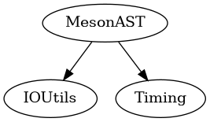

# MesonAST module
This module is responsible for parsing a source file using tree-sitter, and converting it to an AST of Swift objects to make it easier to work with.

Furthermore it contains the type definitions for meson.

