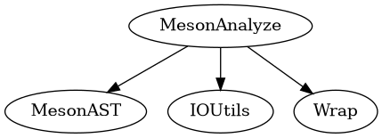

# MesonAnalyze module
This module is built upon the [MesonAST](MesonAST.md) module.

It features a type analyzer, the subproject support and some other minor utilities for analyzing the tree. (Note: The tree consists of the ASTs of different files connected using
`subdir` calls)

## Subprojects
There are three kinds of subprojects.
### Wrap-based subprojects
This type of subproject corresponds to a .wrap file in the `subprojects/` directory at the root of the project. It contains a reference to the wrap file and where the wrap file was setup.
(Somewhere in `~/.cache`)

The `SubprojectState` creates an empty file in the directory where the wrap was setup. If it isn't there next time, the directory is deleted, as the process of setting up the wrap
was probably interrupted.
### Folder-based subprojects
These are subprojects that are simply folders in the `subprojects/` directory. They just contain a reference to this directory and are quite simple.
### Cached subprojects
Each wrap-based subproject will become a cached subproject at the next restart of the language server. They are stored somewhere in `~/.cache`, the key is the SHA256 of the wrap file.
So if the wrap-file was slightly modified, a re-setup is necessary.

But on the other hand, the initial setup process won't be that long as common subprojects between different projects can be cached.

