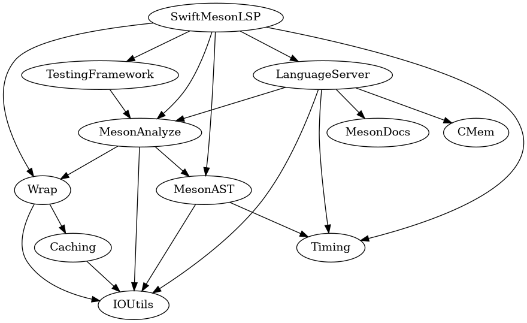

# Module documentation
- [Caching](Caching.md)
- [CMem](CMem.md)
- [IOUtils](IOUtils.md)
- [LanguageServer](LanguageServer.md)
- [MesonAnalyze](MesonAnalyze.md)
- [MesonAST](MesonAST.md)
- [MesonDocs](MesonDocs.md)
- [Wrap](Wrap.md)

