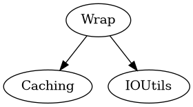

# Wrap module
This module is used for setting up wrap files. The download of files/patches currently requires curl/wget to be installed on the host due to some restrictions of FoundationNetworking.

