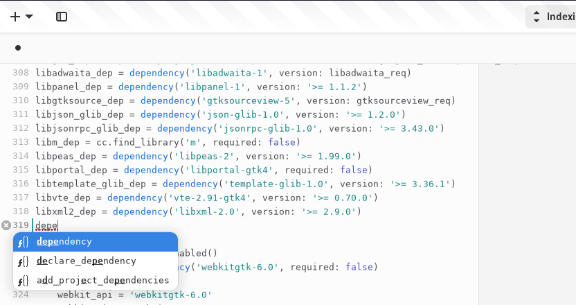

# Swift-MesonLSP
[](https://copr.fedorainfracloud.org/coprs/jcwasmx86/Swift-MesonLSP/package/Swift-MesonLSP/)
[](https://www.codefactor.io/repository/github/jcwasmx86/swift-mesonlsp)
[](https://codecov.io/github/JCWasmx86/Swift-MesonLSP)

[](https://repology.org/project/swift-mesonlsp/versions)

**Note: If you run into timeouts during initialisation please run `mesonlsp --full` in the project directory**

A reimplementation of my Meson language server in Swift.

## Current feature set
- Hovering (Documentation often copied verbatim/minimally modified from mesonbuild, CC BY-SA 4.0, same for the entire `Sources/MesonDocs` directory due to ShareAlike)
- Symbol resolving
- Jump-To-Definition
- Jump-To-Subdir
- A basic set of diagnostics
- Formatting
- Document symbols
- Autocompletion (Somewhat working)
- Inlay hints
- Highlighting
- Automatic subproject/wrap downloads
- Code actions
- Renaming
- Semantic Highlighting
- Folding




## Limitations
- `set_variable`/`get_variable` with non-constant variable name will fail in more complex cases. [See here for working patterns](https://github.com/JCWasmx86/Swift-MesonLSP/blob/main/TestCases/ComputeSetVariable/meson.build)
- `subdir` with non-constant subdir name will fail in more complex cases. [See here for working patterns](https://github.com/JCWasmx86/Swift-MesonLSP/blob/main/TestCases/ComputeSubdirs/meson.build)
- Type deduction is not 100% correct yet
- Type definitions may have minor errors regarding:
  - Is this argument optional?
  - What is the type of the argument?

## Why a reimplementation?
The first version, written in Vala, had some code maintenance problems because basically everything was done in one file.
I had the choice between untangling that mess or rewriting it as cleanly as possible.
I have chosen the latter because I wanted to learn Swift.

## Installation
### Install the language server
#### Easy way
- For Fedora, a COPR is provided: https://copr.fedorainfracloud.org/coprs/jcwasmx86/Swift-MesonLSP/
- For Arch, you can use the repo from [AUR](https://aur.archlinux.org/packages/swift-mesonlsp)
- For Ubuntu 18.04,20.04,22.04 and Debian Bullseye, Bookworm, Sid you can use: https://github.com/JCWasmx86/swift-mesonlsp-apt-repo
- For Ubuntu 22.04, MacOS 12, MacOS 13 and Windows, you can download binaries from the release section: https://github.com/JCWasmx86/Swift-MesonLSP/releases/latest
#### Compile from source
```
git clone https://github.com/JCWasmx86/Swift-MesonLSP
cd Swift-MesonLSP
swift build -c release --static-swift-stdlib
sudo cp .build/release/Swift-MesonLSP /usr/local/bin
```
Or you can use podman (Maybe even docker, but only podman is tested):
```
DOCKER_BUILDKIT=1 podman build --file docker/Dockerfile --output out --no-cache .
# If you want to use Ubuntu 22.04 as docker image
DOCKER_BUILDKIT=1 podman build --file docker/Dockerfile.ubuntu --output out --no-cache .
# If you want to use Ubuntu 18.04 as docker image
DOCKER_BUILDKIT=1 podman build --file docker/Dockerfile.ubuntu1804 --output out --no-cache .
# If you want to use Ubuntu 20.04 as docker image
DOCKER_BUILDKIT=1 podman build --file docker/Dockerfile.ubuntu2004 --output out --no-cache .
```
This will place a file "Fedora37.zip" (Or Ubuntu22.04.zip) in the directory `out`. It contains
two statically linked binaries. Copy `Swift-MesonLSP` to `/usr/local/bin`.

A debug build is provided, too. Just rename it from `Swift-MesonLSP.debug`
to `Swift-MesonLSP` and copy it to the right destination.

### Connect with your editor
#### VSCode (Official support)
Install the official meson extension. If you don't have Swift-MesonLSP in the PATH,
it will ask you whether it should download the language server.
#### GNOME Builder 45 and GNOME Builder Nightly (Official support)
You have to do nothing. The editor already has the support code for Swift-MesonLSP. All you have to do is
installing the language server.
#### Kate (No official support)
Add this JSON to `~/.config/kate/lspclient/settings.json`:
```
{
  "servers": {
    "meson": {
      "command": [
        "Swift-MesonLSP",
        "--lsp"
      ],
      "rootIndicationFileNames": [
        "meson.build",
        "meson_options.txt"
      ],
      "url": "https://github.com/JCWasmx86/Swift-MesonLSP",
      "highlightingModeRegex": "^Meson$"
    }
  }
}
```
After that, a dialog should be shown asking you to confirm that the language server may be started.

#### neovim (No official support)
Add this JSON to `:CocConfig`:
```
{
    "languageserver": {
        "meson": {
            "command": "Swift-MesonLSP",
            "args": ["--lsp"],
            "rootPatterns": ["meson.build"],
            "filetypes": ["meson"]
        }
    }
}
```

## Want to contribute?
Take an item from the TODO list in [PROGRESS.md](PROGRESS.md) and work on it. Feel
free to join the matrix channel [#mesonlsp:matrix.org](https://matrix.to/#/#mesonlsp:matrix.org)

### Projects I tested the language server with
- Working fine:
  - [Fractal](https://gitlab.gnome.org/GNOME/fractal)
  - [GitG](https://gitlab.gnome.org/GNOME/gitg)
  - [GLib](https://gitlab.gnome.org/GNOME/glib)
  - [GNOME Builder](https://gitlab.gnome.org/GNOME/gnome-builder)
  - [GNOME Builder Plugins](https://github.com/JCWasmx86/GNOME-Builder-Plugins)
  - [GTK](https://gitlab.gnome.org/GNOME/gtk)
  - [libswiftdemangle](https://github.com/JCWasmx86/libswiftdemangle)
  - [Mesa](https://gitlab.freedesktop.org/mesa/mesa)
  - [QEMU](https://gitlab.com/qemu-project/qemu)
  - [rustc-demangle](https://github.com/JCWasmx86/rustc-demangle)
  - [Systemd](https://github.com/systemd/systemd)
  - [GStreamer](https://gitlab.freedesktop.org/gstreamer/gstreamer)
- Somewhat flaky to unusable
  - [HelenOS](http://www.helenos.org/)
  - [picolibc](https://github.com/picolibc/picolibc)
  - [DPDK](https://www.dpdk.org/)

