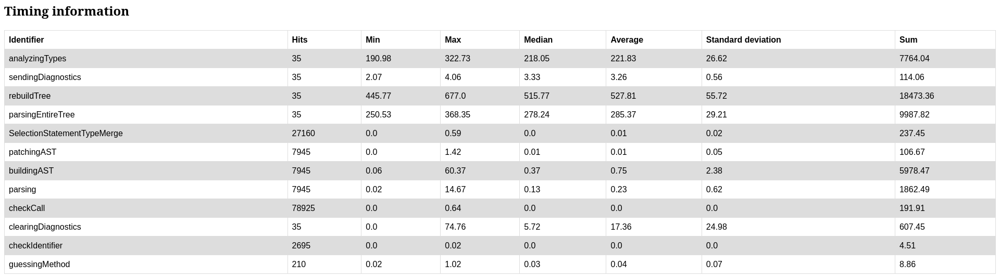

# Swift-MesonLSP


A reimplementation of my Meson language server in Swift.

## Current feature set
- Hovering (Documentation often copied verbatim/minimally modified from mesonbuild, CC BY-SA 4.0, same for the entire `Sources/MesonDocs` directory due to ShareAlike)
- Symbol resolving
- Jump-To-Definition
- Jump-To-Subdir
- A basic set of diagnostics
- Formatting
- Document symbols
- Rudimentary autocompletion
- Inlay hints
- Highlighting

## Limitations
- Not as efficient as it could be: On each `textDocument/didChange` notification, the entire tree is newly typechecked. ASTs without type annotations are cached.
- `set_variable`/`get_variable` with non-constant variable name will fail in more complex cases. [See here for working patterns](https://github.com/JCWasmx86/Swift-MesonLSP/blob/main/TestCases/ComputeSetVariable/meson.build)
- No wrap/subproject support
- `subdir` with non-constant subdir name will fail in more complex cases. [See here for working patterns](https://github.com/JCWasmx86/Swift-MesonLSP/blob/main/TestCases/ComputeSubdirs/meson.build)
- Type deduction is not 100% correct yet
- Autocompletion is very flaky
- Type definitions may have minor errors regarding:
  - Is this argument optional?
  - What is the type of the argument?

## Why a reimplementation?
The first version, written in Vala, had some code maintenance problems because basically everything was done in one file.
I had the choice between untangling that mess or rewriting it as cleanly as possible.
I have chosen the latter because I wanted to learn Swift.

## Contact
I made a matrix channel: [#mesonlsp:matrix.org](https://matrix.to/#/#mesonlsp:matrix.org) Feel free to join
in case you want to ask questions, get support or contribute.

## Installation
### Dependencies
#### Fedora
- Language Server: `sudo dnf install swift-lang libstdc++-static`
- GNOME-Builder plugin: `sudo dnf install git vala meson gcc libgee-devel json-glib-devel gtk4-devel gtksourceview5-devel libadwaita-devel libpeas-devel template-glib-devel g++ libsoup3-devel`
#### Ubuntu
TBD: For the moment, just follow what the docker files do:
- [Language Server](https://github.com/JCWasmx86/Swift-MesonLSP/blob/main/Dockerfile.ubuntu)
- [GNOME-Builder plugin](https://github.com/JCWasmx86/GNOME-Builder-Plugins/blob/main/Dockerfile.ubuntu)
### Install the language server
You can either [download](https://github.com/JCWasmx86/Swift-MesonLSP/releases/tag/v1.4) the file from the releases or build it yourself.
```
git clone https://github.com/JCWasmx86/Swift-MesonLSP
cd Swift-MesonLSP
swift build -c release --static-swift-stdlib
sudo cp .build/release/Swift-MesonLSP /usr/local/bin
```
Or you can use podman (Maybe even docker, but only podman is tested):
```
DOCKER_BUILDKIT=1 podman build --file Dockerfile --output out --no-cache .
# If you want to use Ubuntu as docker image
DOCKER_BUILDKIT=1 podman build --file Dockerfile.ubuntu --output out --no-cache .
```
This will place a file "Fedora37.zip" (Or Ubuntu22.04.zip) in the directory `out`. It contains
two statically linked binaries. Copy `Swift-MesonLSP` to `/usr/local/bin`.

A debug build is provided, too. Just rename it from `Swift-MesonLSP.debug`
to `Swift-MesonLSP` and copy it to the right destination.

### Connect with your editor
#### GNOME Builder Nightly
```
git clone https://github.com/JCWasmx86/GNOME-Builder-Plugins
cd GNOME-Builder-Plugins
# The other plugins in the repo
# get disabled
meson -Dplugin_clangd=disabled \
      -Dplugin_gitgui=disabled \
      -Dplugin_icon_installer=disabled \
      -Dplugin_scriptdir=disabled \
      -Dplugin_shfmt=disabled \
      -Dplugin_swift_templates=disabled \
      -Dplugin_texlab=disabled \
      _build
cd _build
# Don't do "sudo ninja install"
ninja -j $(nproc) install
```
#### Kate
Add this JSON to `~/.config/kate/lspclient/settings.json`:
```
{
  "servers": {
    "meson": {
      "command": [
        "Swift-MesonLSP",
        "--lsp"
      ],
      "rootIndicationFileNames": [
        "meson.build",
        "meson_options.txt"
      ],
      "url": "https://github.com/JCWasmx86/Swift-MesonLSP",
      "highlightingModeRegex": "^Meson$"
    }
  }
}
```
After that, a dialog should be shown asking you to confirm that the language server may be started.

#### neovim
Add this JSON to `:CocConfig`:
```
{
    "languageserver": {
        "meson": {
            "command": "Swift-MesonLSP",
            "args": ["--lsp"],
            "rootPatterns": ["meson.build"],
            "filetypes": ["meson"]
        }
    }
}
```
#### VSCode
Install this fork of vscode-meson: https://github.com/JCWasmx86/vscode-meson

### Notes
On Fedora, you can use the `install.sh` script. It will automatically install all dependencies. (It will ask you for
your root password using `sudo`, but don't execute the script using `sudo`)

## Want to contribute?
Take an item from the TODO list in [PROGRESS.md](PROGRESS.md) and work on it. Feel
free to join the matrix channel [#mesonlsp:matrix.org](https://matrix.to/#/#mesonlsp:matrix.org)

## Debugging performance problems
The language server is measuring the duration needed by certain operations and exposes it using a HTTP-Server on `http://localhost:65000` (Or any higher port, if 65000 is already used)


This picture shows an example of the rendered timing information. The project used is mesa and it
got fully parsed 35 times.

- `analyzingTypes` is the section in which all nodes of the AST are annotated with their possible type(s)
- `sendingDiagnostics` is the section, where all diagnostics are sent back to the editor/client
- `rebuildTree` is responsible for clearing all diagnostics, parsing all meson files, annotating the types, sending the newdiagnostics
- `parsingEntireTree` is the section for parsing the entire project, patching the ASTs, etc.
- `SelectionStatementTypeMerge` is part of the type analyzer. It is responsible for merging the possible types after different branches.
- `patchingAST` is the section in which all `subdir('foo')` calls are replaced by nodes referencing the corresponding source files.
- `buildingAST` is the section in which the tree sitter nodes are converted to easier to use objects
- `parsing` is the section for just parsing a file using tree-sitter
- `checkCall` is for checking the arguments of the call (Except type checking at the moment)
- `clearingDiagnostics` is the section in that all diagnostics are cleared before rebuilding the tree.
- `checkIdentifier` checks, if an identifier follows `snake_case`
- `guessingMethod` is a method that attempts to deduce the possible methods that are called on an `any` object.
- `evalStack` is responsible for getting types of variables that were overwritten in previous branches of selection statements.

In this example, it took around half-second to parse the entire mesa meson files, deduce the types and emit diagnostics.

## Code coverage
- Build with `swift build -c release --static-swift-stdlib -Xswiftc -profile-generate -Xswiftc -profile-coverage-mapping`
- Run the program
- `cp default.profraw /somedir`
- `llvm-profdata merge -sparse default.profraw -o default.profdata`
- `llvm-cov export --instr-profile default.profdata ~/Projects/Swift-MesonLSP/.build/release/Swift-MesonLSP -format lcov|swift demangle > out.lcov`
- `genhtml --ignore-errors source out.lcov --legend --output-directory=/tmp/somepath`

## References
- [gnome-builder#629](https://gitlab.gnome.org/GNOME/gnome-builder/-/issues/629) An issue somewhat related to this project.
### Dependencies
- [ConsoleKit](https://github.com/vapor/console-kit.git) - APIs for creating interactive CLI tools. (Used the loghandler from there to have nice logs)
- [Perfect-INIParser](https://github.com/PerfectlySoft/Perfect-INIParser) - A lightweight INI file parser in Server Side Swift 
- [sourcekit-lsp](https://github.com/apple/sourcekit-lsp) - Language Server Protocol implementation for Swift and C-based languages. (I used the JSONRPC definitions from them)
- [swift-argument-parser](https://github.com/apple/swift-argument-parser) - Straightforward, type-safe argument parsing for Swift
- [swift-atomics](https://github.com/apple/swift-atomics.git) - Lowlevel atomic operations for Swift
- [Swifter](https://github.com/httpswift/swifter) - Tiny http server engine written in Swift programming language.
- [swift-crypto](https://github.com/apple/swift-crypto) - Open-source implementation of a substantial portion of the API of Apple CryptoKit suitable for use on Linux platforms.
- [swift-log](https://github.com/apple/swift-log) - A Logging API for Swift
- [SwiftTreeSitter](https://github.com/ChimeHQ/SwiftTreeSitter) - Swift API for the tree-sitter incremental parsing system
- [tree-sitter-meson](https://github.com/JCWasmx86/tree-sitter-meson) - A tree-sitter grammar for meson.build files. Forked and enhanced by me.

### Projects I tested the language server with
- Working fine:
  - [Fractal](https://gitlab.gnome.org/GNOME/fractal)
  - [GitG](https://gitlab.gnome.org/GNOME/gitg)
  - [GLib](https://gitlab.gnome.org/GNOME/glib)
  - [GNOME Builder](https://gitlab.gnome.org/GNOME/gnome-builder)
  - [GNOME Builder Plugins](https://github.com/JCWasmx86/GNOME-Builder-Plugins)
  - [GTK](https://gitlab.gnome.org/GNOME/gtk)
  - [libswiftdemangle](https://github.com/JCWasmx86/libswiftdemangle)
  - [Mesa](https://gitlab.freedesktop.org/mesa/mesa)
  - [QEMU](https://gitlab.com/qemu-project/qemu)
  - [rustc-demangle](https://github.com/JCWasmx86/rustc-demangle)
  - [Systemd](https://github.com/systemd/systemd)
- Somewhat flaky:
  - [GStreamer](https://gitlab.freedesktop.org/gstreamer/gstreamer)
